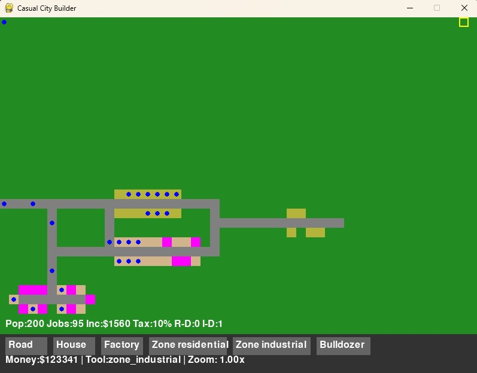

# 🏙️ Tiletopia

Tiletopia is a casual 2D top-down city builder built in Pygame. It features dynamic Sims, pathfinding vehicles, economy and zoning systems, and a tile-based construction mechanic—all rendered in real time with zoom and pan support.



---

## 🎮 Features

- 🧱 Tile placement: roads, houses, factories, zoning
- 👥 Sim agents with home and job logic
- 🚗 Vehicles using A* pathfinding
- 🏛️ Real-time economy and income generation
- 🔍 Smooth zoom/pan camera
- 💾 Save/load system for maps

---

## 🕹️ Controls

| Key / Input         | Action                         |
|---------------------|--------------------------------|
| Mouse Left Click    | Place selected tile/tool       |
| Mouse Middle Drag   | Pan the map                    |
| Mouse Wheel         | Zoom in/out                    |
| `W`, `A`, `S`, `D`  | Move camera                    |
| `S` (key)           | Save map                       |
| `L` (key)           | Load saved map                 |

---

## 🔧 Setup

### 1. Clone the project

```bash
git clone https://github.com/YOUR_USERNAME/Tiletopia.git
cd Tiletopia

2. Create and activate virtual environment
python -m venv venv
.\venv\Scripts\Activate.ps1        # PowerShell
# OR
venv\Scripts\activate.bat          # CMD

3. Install requirements
pip install -r requirements.txt

🚀 Run the Game
python src/main.py

📁 Project Structure
arduino
Copy
Edit
Tiletopia/
├── assets/                     # (future tiles, sounds, etc.)
├── src/
│   ├── camera.py
│   ├── config.py
│   ├── economy.py
│   ├── game.py
│   ├── main.py                 # Game entry point
│   ├── map.py
│   ├── pathfinding.py
│   ├── player.py
│   ├── sim.py
│   ├── tile.py
│   ├── ui.py
│   ├── utils.py
│   └── vehicle.py
├── map.json                    # Saved map data
├── requirements.txt
├── venv/                       # Local virtual environment
└── README.md
📜 License
MIT License — build, remix, and share freely!

👨‍💻 Author
Made by Ash
Enjoy the tiles, chaos, and charm!
